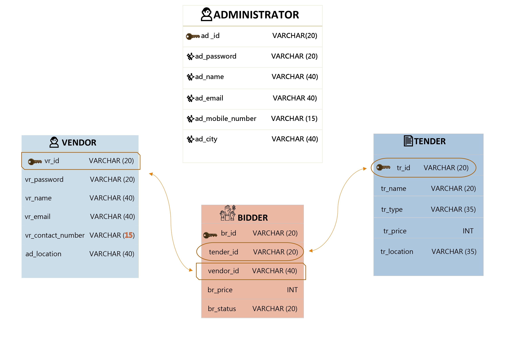

 ### <h1 align="center">FOREST COMMAND</h1>
 ### <h2 align="center">Best Place For Managing Tenders</h2>
 

  

Whenever a company  requires a service / merchandise , a tender is floated. Company maintains an empaneled list of Vendors. An empaneled vendor can only bid for a tender. Every vendor can bid only once against   each tender. Against each tender there may be   bids from several vendors. The company will then select the most suitable bid and places the order to that vendor.

## ER Diagram

:star: Star me on GitHub — it helps!

## Features 📋
⚡️ Fully Responsive\
⚡️ Valid HTML5 & CSS3\
⚡️ User can Download Resume\
⚡️ Typing animation using `Typed.js`\
⚡️ Easy to modify\
⚡️ User can connect in different platforms

## Tools Used 🛠️
<table align="center">
  
  <tr>
      <td align="center" width="100">
        
       My SQL
    </td>
    
 <td align="center" width="100">
        
       JDBC
    </td> 
    
<td align="center" width="100">
        
       SpringBoot
    </td>
    
<td align="center" width="100">
        
       Java 
    </td>
    
<td align="center" width="100">
        
       GitHub
    </td> 
  </tr> 
  </table>

 

## Contributing 💡
#### Step 1️⃣    -> Clone this repo to your local machine 🖥️.

#### Step 2️⃣    -> **Build your code** ⚒️

#### Step 3️⃣    -> 🔃 Create a new pull request.

<a href="https://shubh2-0.github.io/ShubhamBhati.github.io/" target="_blank">**Visit Now** 🚀</a>

<h2>📬 Contact</h2>

If you want to contact me, you can reach me through below handles.

&nbsp;&nbsp;<a href="https://www.linkedin.com/in/shubham-bhati-787319213/"></img></a>

